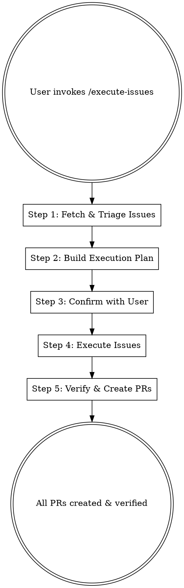

# /execute-issues - Execute GitHub Issues

Implement open GitHub issues created from a PRD breakdown. Each issue gets its own branch, implementation, tests, and PR — verified working before marking complete.

## When to Use

- User says "execute issues" or "implement these issues"
- A `/prd-to-issues` breakdown just completed and user wants to build
- User wants to work through a backlog of related GitHub issues

## Builder Agent Identity

When invoked by Scout, each execution instance is a named Builder agent:

| Property | Value |
|----------|-------|
| **Name** | Builder-N (Builder-1, Builder-2, etc.) |
| **Color** | Green |
| **Hex** | `#16A34A` |
| **Icon** | `🟢` |
| **cmux Tab** | `Builder-1`, `Builder-2`, etc. |

When running standalone (not via Scout), the Builder identity is informational only.

## Workflow



## cmux-Aware Parallel Execution

When Scout passes cmux context (workspace ref + cmux mode flag), execute-issues spawns each Builder in its own cmux tab:

### Tab Spawning (per wave)

For each issue in a wave, Scout spawns a Builder tab:

- Tab named `Builder-N` (where N is the issue number or sequential index)
- Tab colored green via `cmux set-status --icon "🟢" --color "#16A34A"`
- Each Builder works independently on its assigned issue
- On completion: writes result file, tab status updates to ✅ or ❌

### Non-cmux Parallel Execution

Without cmux, builders within a wave run as parallel Agent tool dispatches. Same behavior, no visual tabs.

### Step 1: Fetch & Triage Issues

Ask the user for the parent PRD issue number or label to find related issues.

```bash
# Fetch child issues referencing the PRD
gh issue list --search "Parent PRD #<number>" --state open --json number,title,body,labels
# Or by label
gh issue list --label "<label>" --state open --json number,title,body,labels
```

Parse each issue to extract:
- **Issue number and title**
- **Acceptance criteria** (checkboxes from the issue body)
- **Blocked by** dependencies (other issue numbers)
- **Type**: AFK (can be fully automated) vs HITL (needs human decision)

### Step 2: Build Execution Plan

Sort issues into **waves** based on dependency order:

- **Wave 1**: Issues with no blockers (can start immediately)
- **Wave 2**: Issues blocked only by Wave 1
- **Wave N**: Issues blocked only by completed waves

Within each wave, issues are independent and can be executed in parallel.

Present the execution plan:

```
Wave 1 (parallel):
  #12 - Add user profile schema [AFK]
  #13 - Create base API route [AFK]

Wave 2 (after Wave 1):
  #14 - Implement profile CRUD [AFK, blocked by #12, #13]

Wave 3 (after Wave 2):
  #15 - Add profile validation [AFK, blocked by #14]
  #16 - Design review for profile UI [HITL, blocked by #14]
```

### Step 3: Confirm with User

Use `AskUserQuestion` to confirm:
- Is the wave ordering correct?
- Should any HITL issues be skipped for now?
- Should any issues be deprioritized or removed?
- What's the base branch for all work? (default: current branch)

### Step 4: Execute Issues

For each issue in wave order:

#### 4a. Create a feature branch

```bash
git checkout -b issue-<number>-<short-slug> <base-branch>
```

Branch naming: `issue-<number>-<short-description>` (e.g., `issue-12-user-profile-schema`).

#### 4b. Explore relevant code

Before writing code, use the `Explore` agent to understand:
- What existing code relates to this issue
- What patterns and conventions to follow
- What files need to be created or modified

#### 4c. Implement the issue

Write the implementation following:
- The acceptance criteria from the issue body
- Existing codebase patterns and conventions
- The project's CLAUDE.md / AGENTS.md guidelines

Make atomic commits as you go. Each commit should be a logical unit of work.

#### 4d. Verify acceptance criteria

Go through each acceptance criterion checkbox from the issue:
- Run any relevant tests or linting
- Manually verify the behavior matches the criterion
- If a criterion cannot be verified locally, note it for the PR

#### 4e. HITL checkpoint

For HITL issues, pause and use `AskUserQuestion` to:
- Present what was built
- Ask for the human decision or review needed
- Incorporate feedback before proceeding

For AFK issues, continue automatically unless errors are encountered.

#### 4f. Failure recovery with Reconn

When implementation fails (lint errors, test failures, logic errors):

1. **Attempt 1**: Re-read the error output, understand the root cause, fix the code
2. **Attempt 2**: Try a different approach to the same problem
3. **Attempt 3**: Self-dispatch a Reconn research subagent via the Agent tool:
   - Pass the error message, relevant file paths, and what was attempted
   - Reconn searches codebase for similar patterns, web for docs/solutions, notes for prior fixes
   - Reconn writes findings to `/tmp/scout-reconn-builder-N-recovery.md`
4. **Attempt 4**: Apply Reconn's findings to fix the issue
5. **Still failing**: Write failure to result file for Scout escalation

The Reconn dispatch uses the Agent tool (in-process subagent), NOT a cmux tab. Each Builder carries the /reconn skill instructions in its prompt for self-dispatch.

### Step 5: Create PRs & Close Loop

For each completed issue:

#### 5a. Push and create PR

```bash
git push -u origin issue-<number>-<short-slug>
gh pr create --title "<Issue title>" --body "$(cat <<'EOF'
## Closes #<issue-number>

## Summary
<What was implemented and why>

## Acceptance Criteria Verification
- [x] Criterion 1 — verified by <how>
- [x] Criterion 2 — verified by <how>

## Test Plan
- [ ] <What to test manually>

🤖 Generated with Claude Code /execute-issues
EOF
)"
```

#### 5b. Run verification

After the PR is created:
- Run linting (`npx eslint .` or project-specific lint command)
- Run tests if they exist
- Fix any issues found and push fixes

#### 5c. Report status

After each wave completes, report:

```
Wave 1 complete:
  ✅ #12 - PR #20 created (issue-12-user-profile-schema)
  ✅ #13 - PR #21 created (issue-13-base-api-route)

Starting Wave 2...
```

When all waves are done, present the final summary:

```
All issues executed:
  ✅ #12 → PR #20
  ✅ #13 → PR #21
  ✅ #14 → PR #22
  ✅ #15 → PR #23
  ⏸️  #16 → Skipped (HITL - needs design review)

Next steps:
  - Review and merge PRs in order
  - Address HITL issue #16 separately
```

## Result File Protocol

When invoked by Scout, each Builder writes a result file on completion.

On success:
```json
{"status": "done", "pr": "<pr-number>", "branch": "<branch-name>", "issue": "<issue-number>"}
```

On failure (after all recovery attempts exhausted):
```json
{"status": "failed", "issue": "<issue-number>", "error": "<description>", "attempts": 4}
```

Result files are written to `/tmp/scout-result-builder-N.json` where N matches the Builder's index.

## Key Constraints

- **One branch per issue** — never mix multiple issues in one branch
- **Atomic commits** — each commit should be a logical, reviewable unit
- **Verify before PR** — always run lint/tests before creating the PR
- **Respect dependency order** — never start a blocked issue before its blockers are merged or at least PR'd
- **HITL issues pause** — always stop and ask the user for HITL decisions
- **No force pushes** — standard git workflow only
- **Follow project conventions** — read CLAUDE.md/AGENTS.md before writing code
- **User approval on each wave** — after presenting the plan, execute wave-by-wave with status reports
