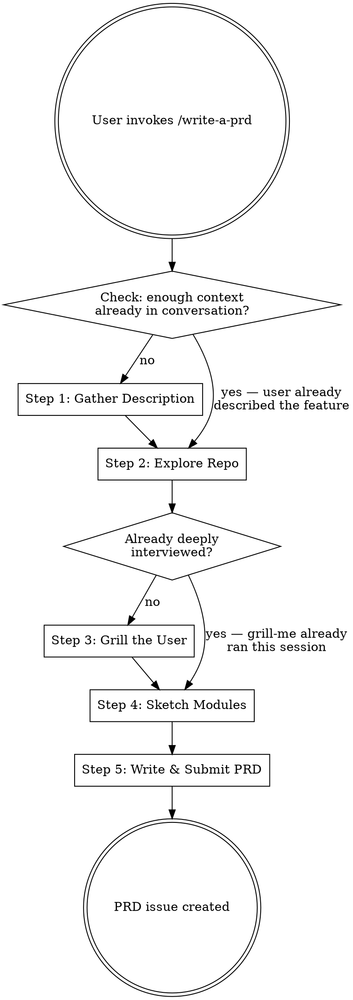

# /write-a-prd - Product Requirements Document

Create a comprehensive PRD through progressive discovery — interview, validate against code, and publish as a GitHub issue.

## When to Use

- User says "write a PRD" or "create a PRD"
- User wants to define product requirements before building
- User needs a feature spec submitted as a GitHub issue
- Pre-implementation scoping for a non-trivial feature

## Workflow



### Step 1: Gather Description

**Skip if:** The user already provided a detailed feature description in this conversation.

Ask the user to describe:
- What they want to build (the feature/product)
- Who it's for (target user)
- Why it matters (problem being solved)
- Any known constraints or non-goals

Use `AskUserQuestion` for structured input. Keep asking follow-ups until you have a clear picture of intent. Don't move on with vague answers — push for specifics.

### Step 2: Explore the Repo

**Always run this step.** Use the `Explore` agent to verify claims against the codebase:

- Does the described integration point actually exist?
- What existing code/modules relate to this feature?
- Are there patterns, conventions, or abstractions the PRD should respect?
- Are there dependencies or technical constraints the user didn't mention?

Report back any discrepancies: "You mentioned X, but the codebase actually does Y."

### Step 3: Grill the User

**Skip if:** A grill-me session already happened this conversation covering this feature.

**REQUIRED SUB-SKILL:** Invoke `superpowers:grill-me` with the gathered context. The grill agent should focus on:

- Ambiguous requirements that need concrete answers
- Edge cases and error scenarios
- Scope boundaries — what's in v1 vs later
- Dependencies and sequencing risks
- Data model and state management decisions
- User experience flows and failure states

The grill session produces a **Decision Summary** — carry all resolved decisions forward into the PRD.

### Step 4: Sketch Modules

Based on everything gathered, outline the major modules/components needed:

1. **List each module** with a one-line purpose
2. **Map dependencies** between modules
3. **Identify new vs modified** — what's greenfield vs changes to existing code
4. **Flag risks** — anything that needs spike/research before committing

Present the module sketch to the user for confirmation before writing the PRD. Use `AskUserQuestion` to confirm: "Here's the module breakdown — anything to add or change?"

### Step 5: Write PRD & Submit as GitHub Issue

Generate the PRD using the template below, then submit it as a GitHub issue.

**Before submitting:** Show the user the full PRD and ask for approval. Do NOT create the issue without explicit confirmation.

**Create the issue:**

```bash
gh issue create --title "<PRD title>" --label "prd" --body "$(cat <<'EOF'
<prd content>
EOF
)"
```

If the `prd` label doesn't exist, create it first:
```bash
gh label create prd --description "Product Requirements Document" --color "0052CC" 2>/dev/null
```

## PRD Template

```markdown
# PRD: <Feature Name>

## Problem Statement
<What problem does this solve? Who has this problem? Why does it matter now?>

## Goals
<Bulleted list of measurable outcomes this feature should achieve>

## Non-Goals
<Explicitly out of scope for this version>

## Target Users
<Who uses this and in what context?>

## User Stories
<Key user stories in "As a [user], I want [action] so that [outcome]" format>

- As a ..., I want ... so that ...

## Proposed Solution

### Overview
<High-level description of the approach>

### Module Breakdown
<From Step 4 — each module with purpose, new vs modified, and dependencies>

| Module | Purpose | Type | Dependencies |
|--------|---------|------|-------------|
| ... | ... | New/Modified | ... |

### Data Model
<Key entities, relationships, and state — if applicable>

### Key Flows
<Step-by-step for the 2-3 most important user/system flows>

## Edge Cases & Error Handling
<From the grill session — resolved edge cases and how they're handled>

## Dependencies & Risks
<External dependencies, technical risks, unknowns that need spikes>

## Success Criteria
<How do we know this is done? Acceptance criteria for sign-off>

- [ ] ...

## Open Questions
<Anything unresolved from the grill session that needs further input>

---
*Generated with Claude Code /write-a-prd*
```

## Key Constraints

- **Never skip the repo exploration** — assertions must be validated against real code
- **Never submit without user approval** — always show the full PRD first
- **Carry forward all context** — decisions from the grill session must appear in the PRD, not be lost
- **Be concrete** — vague requirements like "should be fast" must be pinned to numbers or criteria during grilling
- **Respect existing patterns** — the module sketch must align with the repo's architecture, not impose a new one
